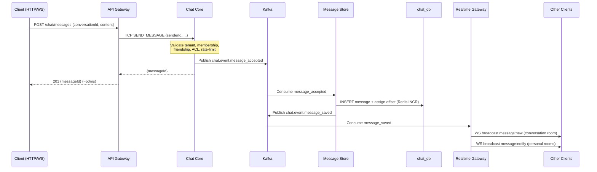

# NestJS Chat Microservices

Production-grade real-time chat system built with **NestJS microservices**, event-driven Kafka architecture, WebSocket real-time delivery, and enterprise-grade ACL.

---

## Architecture Overview

```mermaid
flowchart TB
    subgraph Clients["External Clients"]
        Web["Web / Mobile App"]
    end

    subgraph Auth["Auth"]
        KC["Keycloak\nOAuth2 / JWT RS256\nPort 8080"]
    end

    subgraph GW["API Gateway Layer"]
        APIGW["API Gateway\nHTTP REST\nPort 3000"]
        RTGW["Realtime Gateway\nWebSocket / Socket.IO\nPort 3002"]
    end

    subgraph Services["Microservices - TCP"]
        Users["Users :3001"]
        Presence["Presence :3003"]
        ChatCore["Chat Core :3004"]
        MsgStore["Message Store :3005"]
        ConvSvc["Conversation :3007"]
        FriendSvc["Friendship :3008"]
        MediaSvc["Media Service HTTP :3009"]
        CallSvc["Call Service :3011"]
    end

    subgraph Workers["Background Workers"]
        MediaWorker["Media Worker\nKafka Consumer\nKEDA autoscale"]
        NotifSvc["Notification :3006\nKEDA autoscale"]
    end

    subgraph Kafka["Event Bus"]
        K1["Kafka broker-1\n:9092"]
    end

    subgraph Storage["Storage"]
        MinIO["MinIO S3\nPort 9010"]
        PGUsers["PostgreSQL\nusers_db :5434"]
        PGChat["PostgreSQL\nchat_db :5433"]
        Mongo["MongoDB\nmedia_db :27017"]
        Redis["Redis :6380"]
    end

    subgraph WebRTC["WebRTC Plane"]
        LK["LiveKit SFU\n:7880-7882"]
        COTURN["coturn TURN :3478"]
    end

    Web -->|HTTPS| APIGW
    Web -->|WebSocket| RTGW
    Web -->|OAuth 2.0| KC
    Web -->|HTTP Upload| MediaSvc

    APIGW -->|Verify JWT JWKS| KC
    RTGW -->|Verify JWT JWKS| KC
    MediaSvc -->|Verify JWT JWKS| KC

    APIGW -->|TCP| Users
    APIGW -->|TCP| FriendSvc
    APIGW -->|TCP| ConvSvc
    APIGW -->|TCP| ChatCore
    APIGW -->|TCP| MsgStore
    APIGW -->|TCP| Presence
    APIGW -->|TCP| CallSvc
    APIGW -->|HTTP| MediaSvc

    RTGW -->|TCP| ChatCore
    RTGW -->|TCP| ConvSvc
    RTGW -->|TCP| Presence
    RTGW -->|Consume| K1

    ChatCore -->|TCP| ConvSvc
    ChatCore -->|TCP| FriendSvc
    ChatCore -->|TCP| MsgStore
    ChatCore -->|HTTP| MediaSvc
    ChatCore -->|Publish| K1

    MsgStore -->|TCP| ConvSvc
    MsgStore -->|Consume + Publish| K1

    FriendSvc -->|Publish| K1
    ConvSvc -->|Consume + Publish| K1
    MediaSvc -->|Publish| K1

    CallSvc -->|REST| LK
    CallSvc -->|Consume + Publish| K1

    MediaWorker -->|Consume + Publish| K1
    MediaWorker -->|Read Write| MinIO
    MediaWorker -->|Update| Mongo

    Users -->|Read Write| PGUsers
    FriendSvc -->|Read Write| PGUsers
    ConvSvc -->|Read Write| PGChat
    MsgStore -->|Read Write| PGChat
    CallSvc -->|Read Write| PGChat
    MediaSvc -->|Metadata| Mongo
    MediaSvc -->|Files| MinIO
    Presence -->|Status| Redis
    APIGW -->|Cache| Redis
    RTGW -->|Socket adapter| Redis
```

### Communication Model

| Pattern | Used For |
|---------|----------|
| **HTTP REST → TCP (sync)** | All Gateway → Service calls; request/response with 5 s timeout |
| **Kafka events (async)** | State changes: MESSAGE_ACCEPTED → MESSAGE_SAVED → broadcast |
| **WebSocket (duplex)** | Client real-time events: send message, typing, presence |
| **Transactional Outbox** | Zero-loss event delivery — DB write + outbox event in same transaction |

---

## Core Message Flow

---

## Services

| Service | Port | Protocol | Responsibility | K8s Namespace |
|---------|------|----------|----------------|--------------|
| **API Gateway** | 3000 | HTTP | JWT verify, HTTP→TCP routing, rate-limit, session cache | `apps` |
| **Realtime Gateway** | 3002 | WebSocket | Socket.IO, Kafka consumer, WS broadcast, call signaling | `stateful` |
| **Users** | 3001 | TCP | User profile CRUD, Keycloak sync, avatar media ID | `apps` |
| **Presence** | 3003 | TCP + Redis | Online/offline heartbeat, TTL keys Redis | `apps` |
| **Chat Core** | 3004 | TCP + Kafka | ACL chain, 2-level cache, Kafka outbox, REVOKE/EDIT/DELETE | `stateful` |
| **Message Store** | 3005 | TCP + Kafka | Persist messages, atomic offset Redis INCR, reactions | `apps` |
| **Conversation** | 3007 | TCP + Kafka | Conversation CRUD, membership, group v2 (polls, appointments, join requests) | `apps` |
| **Friendship** | 3008 | TCP + Kafka | Friend requests, block/unblock, auto-create DIRECT conversation | `apps` |
| **Media Service** | 3009 | TCP + Kafka | Pre-signed URLs, MinIO storage, MongoDB metadata, checksum | `apps` |
| **Call Service** | 3011 | TCP + Kafka | Meeting lifecycle, LiveKit token, Transactional Outbox | `apps` |
| **Media Worker** | — | Kafka | Sharp thumbnail, ffmpeg transcode 720p/360p, KEDA autoscale | `apps` |
| **Notification** | 3006 | TCP + Kafka + BullMQ | FCM/APNS/Web push, email OTP, KEDA autoscale | `apps` |

---

## Infrastructure

### Local development (docker-compose)

| Component | Host port | Purpose |
|-----------|-----------|---------|
| Keycloak 26.0 | 8080 | IAM, JWT RS256, JWKS endpoint |
| Kafka + ZooKeeper | 9092 / 2181 | Event streaming (single broker; kafka-2/3 commented out) |
| PostgreSQL — users_db | 5434 | Users + Friendship tables |
| PostgreSQL — chat_db | 5433 | Conversations + Messages + Calls + Group management |
| MongoDB — media_db | 27017 | Media metadata |
| MinIO | 9010 | S3-compatible object storage |
| Redis | 6380 | Presence, general cache, Socket.IO adapter |
| LiveKit SFU | 7880-7882 | WebRTC media plane |
| coturn TURN | 3478 | NAT traversal for WebRTC clients |
| Kafdrop | 9000 | Kafka topic/message browser UI |
| MinIO Console | 9011/9012 | MinIO admin UI |
| Redis Commander | 8081 | Redis GUI |

### Production (Kubernetes — squad.id.vn)

Xem `nest-api-gitops` và `nest-api-infra` để biết chi tiết cấu hình production. Điểm khác biệt chính so với dev:
- Kafka chạy KRaft mode (Bitnami chart 32.4.3 / Kafka 4.0) — không dùng ZooKeeper
- Mỗi service có database riêng biệt (5 DBs trong postgres-chat, 2 DBs trong postgres-users)
- PgBouncer connection pooling trước mỗi Postgres
- Secrets quản lý qua HashiCorp Vault + External Secrets Operator

---

## Role System

Conversations use a **three-tier role hierarchy** (`owner > admin > member`):

| Role | Description |
|------|-------------|
| `owner` | Creator; can disband group, kick any member, transfer settings |
| `admin` | Elevated; can add/remove members, pin messages, manage join requests |
| `member` | Regular user; can send messages (unless `allowMemberMessage = false`) |

Announcement conversations (`type = announcement`) enforce a broadcast-only model: only `owner`/`admin` may post; `member` can only react.

---

## Group Management

The **Group Management** module (v2) adds advanced group capabilities:

- **Settings** (`PATCH /conversations/:id/settings`): control `allowMemberMessage`, `isPublic`, `joinApprovalRequired`
- **Disband** (`DELETE /conversations/:id`): OWNER-only permanent group deletion
- **Leave** (`POST /conversations/:id/leave`): any member except OWNER may leave
- **Kick** (`DELETE /conversations/:id/members/:userId`): OWNER/ADMIN kick members
- **Invite link** (`POST /conversations/:id/invite-link`): JWT-signed link with 7-day TTL; revoke all via version increment
- **Join via token** (`POST /conversations/join`): direct join or pending join request depending on `joinApprovalRequired`
- **Join requests** (`POST/GET/PATCH /conversations/:id/join-requests`): approval workflow for controlled-access groups

All group events are published to Kafka (`group.event.*`) with `conversationId` as the partition key for strict FIFO ordering, then fan-out to members via WebSocket (`GroupEventsConsumer` in Realtime Gateway).

See [docs/api/group-management-api.md](docs/api/group-management-api.md) and [docs/FE_INTEGRATION_GUIDE.md](docs/FE_INTEGRATION_GUIDE.md) for full API reference.

---

## Reaction System

Reactions dùng fast-track Redis Pub/Sub — bypass Kafka hoàn toàn:

- **Write path**: `MessageStoreService.reactToMessage` ghi vào Redis Hash `msg:reaction:{messageId}`, mark dirty, và publish lên Redis Pub/Sub channel `reactions:conv:{conversationId}`
- **Realtime delivery**: `ReactionPubSubService` trong realtime-gateway subscribe channel, emit `message:reaction_updated` đến conversation room ngay lập tức
- **Persistence**: `ReactionSyncJob` chạy định kỳ, đọc dirty set, batch UPDATE vào PostgreSQL

Thiết kế này tách write path (Redis, ~1ms) với persistence (PostgreSQL batch) và realtime (Pub/Sub, < 10ms), không qua Kafka outbox.

---

## Call Signaling Fast-Track

Call signaling cũng dùng Redis Pub/Sub — bypass Kafka để đạt latency < 50ms:

- **Channel**: `realtime:call_events` (constant `REDIS_KEYS.CHANNELS.CALL_SIGNALING`)
- **Published bởi**: `call-service` (`CallSignalingPublisher`) ngay sau khi DB transaction commit
- **Subscribed bởi**: `CallSignalingSubscriber` trong realtime-gateway — dedicated ioredis connection, không share
- **WS fan-out**: Realtime Gateway emit `call:ringing` / `call:accepted` / `call:declined` / `call:ended` đến đúng rooms

Kafka vẫn dùng cho durability và analytics pipeline — Pub/Sub chỉ là fast delivery path song song.

---

## Session Management

### SoftLimitService

Giới hạn per-platform connections per-Keycloak-session:
- `MAX_WEB = 1` — tối đa 1 connection trên Web
- `MAX_MOBILE = 1` — tối đa 1 connection trên Mobile

Khi user authenticate socket mới và platform đã có active socket từ cùng session, socket cũ bị force-kick. Redis key `ws:user:{userId}:sockets:{platform}` cho phép lookup per-platform mà không cần scan toàn bộ sockets.

### SessionRevocationService

Force-kick WebSocket qua Redis Pub/Sub khi session bị revoke (multi-device management, security logout). Emit `session:revoked` đến socket trước khi close.

### SessionGuard

Gateway-level guard kiểm tra session fingerprint trên mỗi request — đảm bảo JWT còn valid và session chưa bị revoke.

---

## Documentation Index

| Document | Description |
|----------|-------------|
| [docs/API_REFERENCE.md](docs/API_REFERENCE.md) | Full REST API reference |
| [docs/FE_INTEGRATION_GUIDE.md](docs/FE_INTEGRATION_GUIDE.md) | Frontend integration guide (Group Management) |
| [docs/DESIGN_PATTERNS.md](docs/DESIGN_PATTERNS.md) | Architectural design patterns |
| [docs/OPERATIONS_GUIDE.md](OPERATIONS_GUIDE.md) | Deployment and operations runbook |
| [docs/TESTING.md](docs/TESTING.md) | Testing strategy, 31 spec files, test commands |
| [docs/api/group-management-api.md](docs/api/group-management-api.md) | Group Management REST + WebSocket API |
| [docs/api/messages-api.md](docs/api/messages-api.md) | Messages REST + WebSocket API |
| [docs/api/call-api.md](docs/api/call-api.md) | Call Service API |
| [docs/api/media-api.md](docs/api/media-api.md) | Media upload/playback API |
| [docs/diagrams/system-architecture.md](docs/diagrams/system-architecture.md) | System architecture diagrams |
| [docs/diagrams/database-relations.md](docs/diagrams/database-relations.md) | Database schema and relations |
| [docs/diagrams/kafka-topology.md](docs/diagrams/kafka-topology.md) | Kafka topics and consumer groups |
| [docs/diagrams/redis-keys.md](docs/diagrams/redis-keys.md) | Redis key patterns, TTL, Pub/Sub channels |
| [docs/libraries/LIBRARIES.md](docs/libraries/LIBRARIES.md) | 7 shared libraries overview |
| [docs/integration/SYSTEM_MESSAGES.md](docs/integration/SYSTEM_MESSAGES.md) | System message format reference |
| [docs/services/conversation-service.md](docs/services/conversation-service.md) | Conversation Service internals |
| [docs/services/chat-core.md](docs/services/chat-core.md) | Chat Core internals |
| [docs/services/realtime-gateway.md](docs/services/realtime-gateway.md) | Realtime Gateway internals |
| [docs/services/call-service.md](docs/services/call-service.md) | Call Service internals |
| [docs/services/media-worker.md](docs/services/media-worker.md) | Media Worker internals |
