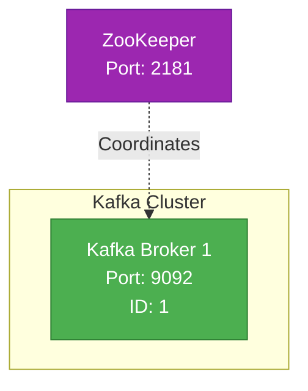
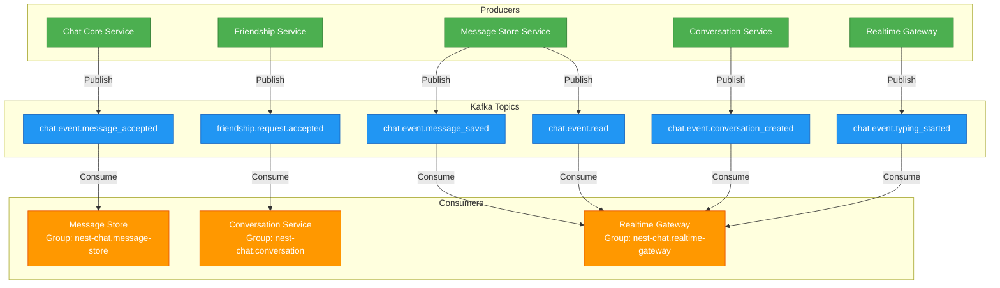
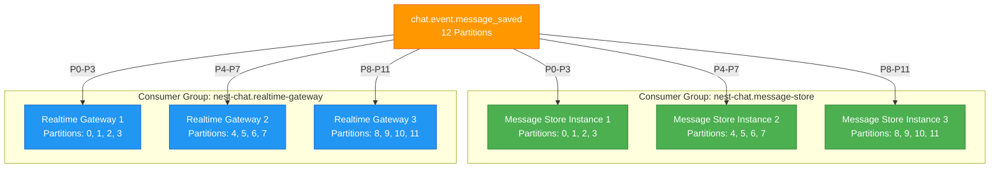

# Kafka Topology

## Topic Inventory thực tế

Danh sách đầy đủ các topics được tạo bởi `scripts/init-kafka-topics-container.sh`. Số partition mặc định do biến môi trường `KAFKA_DEFAULT_PARTITIONS` (dev: 1, prod: 3); `KAFKA_HIGH_VOLUME_PARTITIONS` (dev: bằng default, prod: 12).

### Commands (retention 1 ngày)

| Topic | Partition | Ghi chú |
|-------|-----------|---------|
| `chat.command.send` | HIGH_VOLUME | Lệnh gửi tin nhắn |
| `chat.command.delete` | DEFAULT | Lệnh xóa tin nhắn |
| `chat.command.read` | HIGH_VOLUME | Lệnh đánh dấu đã đọc |

### Message Events (retention 7 ngày)

| Topic | Partition | Ghi chú |
|-------|-----------|---------|
| `chat.event.message_accepted` | HIGH_VOLUME | ChatCore quyết định OK (chưa persist) |
| `chat.event.message_saved` | HIGH_VOLUME | Đã persist vào DB |
| `chat.event.message_rejected` | DEFAULT | Validation thất bại |
| `chat.event.message_read` | HIGH_VOLUME | *(Tên thực tế — không phải `chat.event.read`)* |
| `chat.event.message_updated` | DEFAULT | Nội dung/attachment thay đổi |
| `chat.event.message_edited` | DEFAULT | Tin nhắn được sửa (kèm lịch sử) |
| `chat.event.message_revoked` | DEFAULT | Tombstone 2 chiều |
| `chat.event.message_deleted_for_user` | DEFAULT | Xóa phía người dùng |
| `chat.event.deleted` | DEFAULT | Hard delete (legacy alias) |
| `chat.event.user_joined` | DEFAULT | Thành viên tham gia conversation |
| `chat.event.user_left` | DEFAULT | Thành viên rời conversation |

### Pinned Messages (retention 30 ngày)

| Topic | Partition | Ghi chú |
|-------|-----------|---------|
| `chat.event.message_pinned` | DEFAULT | Ghim tin nhắn |
| `chat.event.message_unpinned` | DEFAULT | Bỏ ghim tin nhắn |

### Conversation Events (retention 30 ngày)

| Topic | Partition | Ghi chú |
|-------|-----------|---------|
| `chat.event.conversation_created` | DEFAULT | Conversation mới |
| `chat.event.conversation_updated` | DEFAULT | Metadata thay đổi |
| `chat.event.conversation_upgraded` | DEFAULT | Conversation được nâng cấp |
| `chat.event.conversation_archived` | DEFAULT | Conversation bị archive |
| `chat.event.member_added` | HIGH_VOLUME | Thêm thành viên |
| `chat.event.member_removed` | HIGH_VOLUME | Xóa thành viên |
| `chat.event.announcement_notify` | DEFAULT | Thông báo "hasNew" kênh announcement (1 ngày) |

### Real-time Events

| Topic | Retention | Partition | Ghi chú |
|-------|-----------|-----------|---------|
| `presence.changed` | 1 ngày | DEFAULT | Trạng thái online/offline |
| `chat.event.typing_started` | 60 giây | DEFAULT | Đang nhập |
| `chat.event.typing_stopped` | 60 giây | DEFAULT | Dừng nhập |

### Dead Letter Queue (retention 30 ngày, 4 partitions)

| Topic | Ghi chú |
|-------|---------|
| `chat.dlq` | DLQ chung cho tất cả messages thất bại |
| `chat.dlq.commands` | DLQ riêng cho commands |
| `chat.dlq.events` | DLQ riêng cho events |

### User Events (retention 7–30 ngày)

| Topic | Retention | Ghi chú |
|-------|-----------|---------|
| `user.deleted` | 30 ngày | Tài khoản bị xóa vĩnh viễn |
| `user.deactivated` | 30 ngày | Tài khoản bị vô hiệu hóa |
| `user.profile.updated` | 7 ngày | Cập nhật profile/avatar |

### Auth Events (retention 30 ngày)

| Topic | Ghi chú |
|-------|---------|
| `auth.events` | Sự kiện bảo mật/audit (password change...) |

### Media Events (retention 7–30 ngày)

| Topic | Retention | Ghi chú |
|-------|-----------|---------|
| `media.uploaded` | 7 ngày | File đã upload lên MinIO |
| `media.ready` | 7 ngày | Xử lý hoàn tất, variants sẵn sàng |
| `media.failed` | 30 ngày | Xử lý thất bại vĩnh viễn |

### Friendship Events (retention 7 ngày)

| Topic | Ghi chú |
|-------|---------|
| `friendship.request.sent` | Gửi lời mời kết bạn |
| `friendship.request.accepted` | Chấp nhận lời mời |
| `friendship.request.rejected` | Từ chối lời mời |
| `friendship.request.canceled` | Hủy lời mời |
| `friendship.removed` | Hủy kết bạn |
| `friendship.blocked` | Chặn người dùng |
| `friendship.unblocked` | Bỏ chặn người dùng |

### Call Events (retention 7 ngày)

| Topic | Ghi chú |
|-------|---------|
| `call.event.ringing` | Cuộc gọi được khởi tạo |
| `call.event.accepted` | Người được gọi chấp nhận |
| `call.event.declined` | Người được gọi từ chối |
| `call.event.ended` | Kết thúc cuộc gọi (mọi trạng thái terminal) |

### Group Management Events

Tất cả sử dụng `conversationId` làm partition key để đảm bảo FIFO ordering per group.

| Topic | Retention | Partition | Ghi chú |
|-------|-----------|-----------|---------|
| `group.event.member_role_changed` | 7 ngày | 4 | Thay đổi role thành viên |
| `group.event.member_kicked` | 7 ngày | 4 | Kick thành viên |
| `group.event.disbanded` | 30 ngày | DEFAULT | Giải tán group |
| `group.event.settings_updated` | 30 ngày | DEFAULT | Cập nhật cài đặt group |
| `group.event.invite_link_reset` | 30 ngày | DEFAULT | Reset invite link |
| `group.event.join_requested` | 7 ngày | DEFAULT | Yêu cầu tham gia group |
| `group.event.join_approved` | 7 ngày | DEFAULT | Duyệt yêu cầu |
| `group.event.join_rejected` | 7 ngày | DEFAULT | Từ chối yêu cầu |
| `group.event.poll_created` | 30 ngày | DEFAULT | Tạo bình chọn |
| `group.event.poll_voted` | 7 ngày | HIGH_VOLUME | Bỏ phiếu |
| `group.event.poll_closed` | 30 ngày | DEFAULT | Đóng bình chọn |
| `group.event.appointment_created` | 30 ngày | DEFAULT | Tạo lịch hẹn |
| `group.event.appointment_updated` | 30 ngày | DEFAULT | Cập nhật lịch hẹn |
| `group.event.appointment_deleted` | 30 ngày | DEFAULT | Xóa lịch hẹn |
| `group.event.appointment_reminder` | 1 ngày | DEFAULT | Nhắc nhở lịch hẹn (ephemeral) |

---

## Consumer Groups thực tế

Từ `libs/kafka/src/constants/kafka-topics.constants.ts`:

| Constant | Group ID | Mô tả |
|----------|----------|-------|
| `CHAT_CORE` | `nest-chat.chat-core` | Chat Core xử lý MESSAGE_ACCEPTED |
| `CHAT_CORE_BLOCK_CACHE` | `nest-chat.chat-core.block-cache` | Cache friendship block status vào Redis |
| `CHAT_CORE_FRIEND_CACHE` | `nest-chat.chat-core.friend-cache` | Cache friendship (isFriend) LWW CAS vào Redis |
| `MESSAGE_STORE` | `nest-chat.message-store` | Persist messages vào DB |
| `MESSAGE_STORE_SYSTEM_EVENTS` | `nest-chat.message-store.system-events` | Member changes → system messages (chạy độc lập) |
| `REALTIME_GATEWAY` | `nest-chat.realtime-gateway` | Broadcast events qua WebSocket |
| `REALTIME_GATEWAY_USER_EVENTS` | `nest-chat.realtime-gateway.user-events` | Force-disconnect khi account deactivated/deleted |
| `REALTIME_GATEWAY_GROUP_EVENTS` | `nest-chat.realtime-gateway.group-events` | Broadcast group management events |
| `REALTIME_GATEWAY_DLQ` | `nest-chat.realtime-gateway.dlq` | DLQ consumer (offset tách biệt với main group) |
| `CONVERSATION_SERVICE` | `nest-chat.conversation-service` | Xử lý friendship events |
| `CONVERSATION_FRIENDSHIP_EVENTS` | `nest-chat.conversation-service.friendship-events` | Friendship lifecycle events |
| `CONVERSATION_CACHE_UPDATER` | `nest-chat.conversation-service.cache-updater` | Cập nhật Redis membership cache |
| `NOTIFICATION` | `nest-chat.notification` | Push notifications |
| `NOTIFICATION_AUTH_EVENTS` | `nest-chat.notification.auth-events` | Sự kiện auth (password change alerts) |
| `ANALYTICS` | `nest-chat.analytics` | Metrics aggregation (planned) |
| `MEDIA` | `nest-chat.media` | Cập nhật trạng thái media sau xử lý |
| `MEDIA_WORKER` | `nest-chat.media-worker` | Xử lý file upload |
| `CALL_SERVICE` | `nest-chat.call-service` | Auto-end call khi membership thay đổi |
| `CALL_SERVICE_REALTIME` | `nest-chat.call-service.realtime` | Broadcast call events qua WebSocket |
| `FRIENDSHIP` | `nest-chat.friendship` | Friendship service |
| `USERS_SERVICE` | `nest-chat.users-service` | Users service consumers |
| `GATEWAY_CACHE_INVALIDATION` | `nest-chat.gateway.cache-invalidation` | Cache invalidation tách biệt với gateway chính |

---

## Overview

This document describes the Kafka cluster architecture, topic configuration, producer/consumer topology, and partitioning strategies used in the chat system.

## Kafka Cluster Architecture

### Cluster Configuration

**Current deployment**: 1 broker (`kafka-1`, port 9092) with ZooKeeper for coordination. The `kafka-2` and `kafka-3` broker definitions exist in docker-compose.yml but are commented out.



### Cluster Specifications

| Configuration | Value | Notes |
|--------------|-------|-------|
| **Brokers** | 1 (active) | Only kafka-1 running; kafka-2 and kafka-3 commented out in docker-compose |
| **Replication Factor** | 1 | Single broker; no replication |
| **Min In-Sync Replicas** | 1 | Not applicable with single broker |
| **ZooKeeper** | 1 | Coordination service |
| **Log Retention** | 7 days | Configurable per topic |
| **Log Segment Size** | 1 GB | Default |

### High Availability

With a single broker, there is no fault tolerance or replication. If `kafka-1` goes down, all Kafka-dependent features (message publishing, event streaming) are unavailable until it recovers. For production deployments, a minimum of 3 brokers with replication factor 3 and min ISR 2 is recommended.

### Topic Inventory

```mermaid
graph LR
    subgraph "Command Topics (1 day retention)"
        CMD1[chat.command.send<br/>12 partitions]
        CMD2[chat.command.delete<br/>12 partitions]
        CMD3[chat.command.read<br/>12 partitions]
    end
    
    subgraph "Message Event Topics (7 day retention)"
        EVT1["chat.event.message_accepted (12 partitions)"]
        EVT2["chat.event.message_saved (12 partitions)"]
        EVT3["chat.event.message_rejected (12 partitions)"]
        EVT6["chat.event.message_updated (12 partitions)"]
        EVT7["chat.event.message_edited (12 partitions)"]
        EVT8["chat.event.message_pinned (6 partitions)"]
        EVT9["chat.event.message_unpinned (6 partitions)"]
        EVT10["chat.event.deleted (12 partitions)"]
        EVT11["chat.event.read (12 partitions)"]
        EVT12["chat.event.message_revoked (3 partitions)"]
        EVT13["chat.event.message_deleted_for_user (3 partitions)"]
    end

    subgraph "Conversation Topics (7 day retention)"
        CONV1["chat.event.conversation_created (6 partitions)"]
        CONV2["chat.event.conversation_updated (6 partitions)"]
        CONV4["chat.event.member_added (6 partitions)"]
        CONV5["chat.event.member_removed (6 partitions)"]
        CONV6["chat.event.announcement_notify (6 partitions)"]
    end

    subgraph "Friendship Topics (7 day retention)"
        FRIEND1["friendship.request.sent (6 partitions)"]
        FRIEND2["friendship.request.accepted (6 partitions)"]
        FRIEND3["friendship.request.rejected (6 partitions)"]
        FRIEND4["friendship.removed (6 partitions)"]
        FRIEND5["friendship.blocked (6 partitions)"]
        FRIEND6["friendship.unblocked (6 partitions)"]
    end

    subgraph "Media Topics (7 day retention)"
        MED1["media.uploaded (6 partitions)"]
        MED2["media.ready (6 partitions)"]
        MED3["media.failed (6 partitions)"]
    end

    subgraph "Call Topics (7 day retention)"
        CALL1["call.event.ringing (6 partitions)"]
        CALL2["call.event.accepted (6 partitions)"]
        CALL3["call.event.declined (6 partitions)"]
        CALL4["call.event.ended (6 partitions)"]
    end

    subgraph "User Events (7 day retention)"
        USR1["user.deleted (6 partitions)"]
        USR2["user.deactivated (6 partitions)"]
        USR3["user.profile.updated (6 partitions)"]
    end
    
    subgraph "Real-Time Topics (30 min retention)"
        RT1[chat.event.typing_started<br/>12 partitions]
        RT2[chat.event.typing_stopped<br/>12 partitions]
        RT3[presence.changed<br/>6 partitions]
    end
    
    subgraph "Dead Letter Queue"
        DLQ1[chat.dlq.commands<br/>3 partitions]
        DLQ2[chat.dlq.events<br/>3 partitions]
    end
    
    classDef cmd fill:#FF5722,stroke:#D84315,color:#fff
    classDef evt fill:#4CAF50,stroke:#2E7D32,color:#fff
    classDef conv fill:#2196F3,stroke:#1565C0,color:#fff
    classDef friend fill:#9C27B0,stroke:#6A1B9A,color:#fff
    classDef rt fill:#FFC107,stroke:#F57F17,color:#000
    classDef dlq fill:#607D8B,stroke:#37474F,color:#fff
    classDef call fill:#E91E63,stroke:#880E4F,color:#fff
    classDef media fill:#009688,stroke:#004D40,color:#fff

    class CMD1,CMD2,CMD3 cmd
    class EVT1,EVT2,EVT3,EVT6,EVT7,EVT8,EVT9,EVT10,EVT11,EVT12,EVT13 evt
    class CONV1,CONV2,CONV4,CONV5,CONV6 conv
    class FRIEND1,FRIEND2,FRIEND3,FRIEND4,FRIEND5,FRIEND6 friend
    class RT1,RT2,RT3 rt
    class DLQ1,DLQ2 dlq
    class CALL1,CALL2,CALL3,CALL4 call
    class MED1,MED2,MED3 media
    class USR1,USR2,USR3 user

    classDef user fill:#795548,stroke:#3E2723,color:#fff
```

### Topic Configuration Details

#### Message Topics

> **Current deployment** uses 1 broker (Replication=1, Min ISR=1). Values below reflect the **production-recommended** configuration (3 brokers).

| Topic | Partitions | Replication (prod) | Retention | Min ISR (prod) | Purpose |
|-------|------------|--------------------|-----------|----------------|--------|
| `chat.command.send` | 12 | 3 | 1 day | 2 | Command to send message |
| `chat.event.message_accepted` | 12 | 3 | 7 days | 2 | Message validated by Chat Core |
| `chat.event.message_saved` | 12 | 3 | 7 days | 2 | Message persisted in DB |
| `chat.event.message_rejected` | 12 | 3 | 7 days | 2 | Message validation failed |
| `chat.event.read` | 12 | 3 | 7 days | 2 | Read receipt updated |
| `chat.event.deleted` | 12 | 3 | 7 days | 2 | Message hard-deleted |
| `chat.event.message_edited` | 12 | 3 | 7 days | 2 | Message content edited |
| `chat.event.message_pinned` | 6 | 3 | 30 days | 2 | Message pinned in conversation |
| `chat.event.message_unpinned` | 6 | 3 | 30 days | 2 | Message unpinned |
| `chat.event.message_revoked` | 3 | 3 | 7 days | 2 | Message revoked by sender (~2 min window) |
| `chat.event.message_deleted_for_user` | 3 | 3 | 7 days | 2 | Message deleted for specific user only |

**Why 12 partitions?**
- High throughput topic (thousands of messages/sec)
- Allows 12 parallel consumers
- Partition key: `conversationId` for ordering

#### Conversation Topics

| Topic | Partitions | Replication (prod) | Retention | Min ISR (prod) | Purpose |
|-------|------------|--------------------|-----------|----------------|--------|
| `chat.event.conversation_created` | 6 | 3 | 7 days | 2 | New conversation created |
| `chat.event.conversation_updated` | 6 | 3 | 7 days | 2 | Conversation metadata updated |
| `chat.event.member_added` | 6 | 3 | 7 days | 2 | Member added to conversation |
| `chat.event.member_removed` | 6 | 3 | 7 days | 2 | Member removed from conversation |
| `chat.event.announcement_notify` | 6 | 3 | 7 days | 2 | `announcement` channel “hasNew” broadcast notification |

**Why 6 partitions?**
- Lower throughput than messages
- Still allows parallel processing
- Partition key: `conversationId`

#### Friendship Topics

| Topic | Partitions | Replication (prod) | Retention | Min ISR (prod) | Purpose |
|-------|------------|--------------------|-----------|----------------|--------|
| `friendship.request.sent` | 6 | 3 | 7 days | 2 | Friend request sent |
| `friendship.request.accepted` | 6 | 3 | 7 days | 2 | Friend request accepted |
| `friendship.request.rejected` | 6 | 3 | 7 days | 2 | Friend request rejected |
| `friendship.removed` | 6 | 3 | 7 days | 2 | Friendship removed |
| `friendship.blocked` | 6 | 3 | 7 days | 2 | User blocked |
| `friendship.unblocked` | 6 | 3 | 7 days | 2 | User unblocked |

**Why 6 partitions?**
- Low-medium throughput
- Partition key: `userId` (requester)

#### Real-Time Topics

| Topic | Partitions | Replication (prod) | Retention | Min ISR (prod) | Purpose |
|-------|------------|--------------------|-----------|----------------|--------|
| `chat.event.typing_started` | 12 | 3 | 30 min | 2 | User started typing |
| `chat.event.typing_stopped` | 12 | 3 | 30 min | 2 | User stopped typing |
| `presence.changed` | 6 | 3 | 30 min | 2 | User online/offline status changed |

**Why 30-minute retention?**
- Ephemeral events, no replay needed
- Reduces storage costs
- Still useful for recent debugging

#### Call Topics

| Topic | Partitions | Replication | Retention | Min ISR | Purpose |
|-------|------------|-------------|-----------|---------|--------|
| `call.event.ringing` | 6 | 3 | 7 days | 2 | Call initiated — callee(s) notified |
| `call.event.accepted` | 6 | 3 | 7 days | 2 | Callee accepted — call transitions to ACTIVE |
| `call.event.declined` | 6 | 3 | 7 days | 2 | Callee declined — call transitions to REJECTED |
| `call.event.ended` | 6 | 3 | 7 days | 2 | Call ended (any terminal transition: ENDED/MISSED) |

**Producer**: Call Service (via Transactional Outbox — events written to `outbox_events` in same DB transaction as state change, then published to Kafka by `CallOutboxProcessor`). Partition key: `callId`.

**Consumers**:
- Realtime Gateway (consumer group `nest-chat.call-service.realtime`) — consumes all 4 topics, broadcasts WebSocket events to clients
- Notification Service (consumer group `nest-chat.notification-service`) — consumes `call.event.ringing`, sends push notification for incoming call

**Why 6 partitions?**
- Lower throughput than message topics (calls are far less frequent than messages)
- Partition key: `callId` for per-call event ordering

#### User Events

| Topic | Partitions | Replication (prod) | Retention | Min ISR (prod) | Purpose |
|-------|------------|--------------------|-----------|----------------|--------|
| `user.deleted` | 6 | 3 | 7 days | 2 | User hard-deleted |
| `user.deactivated` | 6 | 3 | 7 days | 2 | Account disabled (isActive=false) |
| `user.profile.updated` | 6 | 3 | 7 days | 2 | Profile fields or avatar changed |

**Producer**: Users Service
**Consumers**: Realtime Gateway (`nest-chat.realtime-gateway.user-events`), Gateway cache invalidation (`nest-chat.gateway.cache-invalidation`)

#### Media Events

| Topic | Partitions | Replication (prod) | Retention | Min ISR (prod) | Purpose |
|-------|------------|--------------------|-----------|----------------|--------|
| `media.uploaded` | 6 | 3 | 7 days | 2 | File uploaded to MinIO; triggers worker processing |
| `media.ready` | 6 | 3 | 7 days | 2 | Processing complete, variants available |
| `media.failed` | 6 | 3 | 7 days | 2 | Processing permanently failed |

**Note**: `media.retry` was removed — recovery is now handled by a periodic cron job inside media-worker instead of a Kafka retry event.

**Producer**: Media Service (`media.uploaded`), Media Worker (`media.ready`, `media.failed`)
**Consumer**: Media Worker (`media.uploaded`)

## Producer/Consumer Topology

### Complete Service Topology



### Service-Level Breakdown

#### Chat Core Service
**Role**: Producer only

| Action | Topic | Partition Key |
|--------|-------|---------------|
| Message validated | `chat.event.message_accepted` | `conversationId` |
| Message validation failed | `chat.event.message_rejected` | `conversationId` |

**Configuration**:
- `acks: all` (wait for all in-sync replicas)
- `compression.type: lz4` (fast compression)
- `retries: 5`
- `idempotence: true` (prevent duplicates)

#### Message Store Service
**Role**: Consumer + Producer

**Consumes**:
| Topic | Consumer Group | Partitions | Purpose |
|-------|----------------|------------|---------|
| `chat.event.message_accepted` | `nest-chat.message-store` | All 12 | Persist messages to DB |

**Produces**:
| Topic | Partition Key | Purpose |
|-------|---------------|---------|
| `chat.event.message_saved` | `conversationId` | Notify persistence complete |
| `chat.event.read` | `conversationId` | Notify read receipt updated |
| `chat.event.deleted` | `conversationId` | Notify message deleted |

**Configuration**:
- `auto.offset.commit: false` (manual commit after DB write)
- `max.poll.records: 100` (batch processing)
- `session.timeout.ms: 30000`

#### Conversation Service
**Role**: Consumer + Producer

**Consumes**:
| Topic | Consumer Group | Partitions | Purpose |
|-------|----------------|------------|---------|
| `friendship.request.accepted` | `nest-chat.conversation` | All 6 | Auto-create DIRECT conversation |

**Produces**:
| Topic | Partition Key | Purpose |
|-------|---------------|---------|
| `chat.event.conversation_created` | `conversationId` | Notify new conversation |
| `chat.event.conversation_updated` | `conversationId` | Notify metadata changed |
| `chat.event.member_added` | `conversationId` | Notify member added |
| `chat.event.member_removed` | `conversationId` | Notify member removed |

#### Friendship Service
**Role**: Producer only

**Produces**:
| Topic | Partition Key | Purpose |
|-------|---------------|---------|
| `friendship.request.sent` | `fromUserId` | Notify friend request sent |
| `friendship.request.accepted` | `fromUserId` | Notify friendship established |
| `friendship.request.rejected` | `fromUserId` | Notify rejection |
| `friendship.removed` | `userId` | Notify unfriend |
| `friendship.blocked` | `userId` | Notify block |
| `friendship.unblocked` | `userId` | Notify unblock |

#### Chat Core Service
**Role**: Producer + Consumer (friendship/block cache)

**Consumes**:
| Topic | Consumer Group | Partitions | Purpose |
|-------|----------------|------------|---------|
| `friendship.blocked` | `nest-chat.chat-core.block-cache` | All 6 | Cache block status in Redis |
| `friendship.unblocked` | `nest-chat.chat-core.block-cache` | All 6 | Evict block cache key |
| `friendship.request.accepted` | `nest-chat.chat-core.friend-cache` | All 6 | LWW CAS SET friends key (+brokerTs) |
| `friendship.removed` | `nest-chat.chat-core.friend-cache` | All 6 | LWW CAS SET friends tombstone (-brokerTs) |

**Produces**:
| Topic | Partition Key | Purpose |
|-------|---------------|---------|
| `chat.event.message_accepted` | `conversationId` | Validated message ready for persistence |
**Role**: Consumer + Producer (limited)

**Consumes**:
| Topic | Consumer Group | Partitions | Purpose |
|-------|----------------|------------|---------|
| `chat.event.message_saved` | `nest-chat.realtime-gateway` | All 12 | Broadcast message to clients |
| `chat.event.conversation_created` | `nest-chat.realtime-gateway` | All 6 | Notify conversation created |
| `chat.event.member_added` | `nest-chat.realtime-gateway` | All 6 | Notify member added |
| `chat.event.typing_started` | `nest-chat.realtime-gateway` | All 12 | Show typing indicator |
| `chat.event.typing_stopped` | `nest-chat.realtime-gateway` | All 12 | Hide typing indicator |
| `chat.event.read` | `nest-chat.realtime-gateway` | All 12 | Update read receipts |

**Produces**:
| Topic | Partition Key | Purpose |
|-------|---------------|---------|
| `chat.event.typing_started` | `conversationId` | User started typing |
| `chat.event.typing_stopped` | `conversationId` | User stopped typing |

**Configuration**:
- Multiple instances for horizontal scaling
- Each instance consumes subset of partitions
- Load balancing via consumer group rebalancing

#### Call Service
**Role**: Consumer + Producer

**Consumes**:
| Topic | Consumer Group | Partitions | Purpose |
|-------|----------------|------------|--------|
| `chat.event.member_removed` | `nest-chat.call-service` | All 6 | Auto-end any active/ringing call when a member is removed from the conversation (`endReason: membership_revoked`) |

**Produces** (via Transactional Outbox → `CallOutboxProcessor`):
| Topic | Partition Key | Purpose |
|-------|---------------|--------|
| `call.event.ringing` | `callId` | Call initiated by caller — triggers push notification and WS ring on callee devices |
| `call.event.accepted` | `callId` | Callee accepted — call is now ACTIVE |
| `call.event.declined` | `callId` | Callee declined or call auto-rejected |
| `call.event.ended` | `callId` | Call terminated (user ended, ringing timeout, ghost cleanup, membership revoked) |

**Configuration**:
- `acks: all` — call events must not be lost
- `retries: 5`
- `idempotence: true`
- All events written to `outbox_events` (aggregate_type `call`) in the same DB transaction as the state change; `CallOutboxProcessor` polls and publishes

## Partitioning Strategy

### Partition Key Selection

#### Message Topics: `conversationId`

**Reason**: Guarantees message ordering per conversation

```javascript
// Producer (Chat Core)
producer.send({
  topic: 'chat.event.message_accepted',
  key: conversationId, // Partition key
  value: JSON.stringify({
    messageId,
    conversationId,
    senderId,
    content,
    timestamp
  })
});
```

**Result**:
- All messages for `conversation-123` go to same partition
- Consumer processes messages in order (offset 1, 2, 3, ...)
- Critical for chat message ordering

**Partition Distribution**:
```
conversationId hash mod 12 = partition number

conversation-abc → hash % 12 = 0 → Partition 0
conversation-def → hash % 12 = 7 → Partition 7
conversation-xyz → hash % 12 = 3 → Partition 3
```

#### Friendship Topics: `userId`

**Reason**: Groups all friendship events per user

```javascript
// Producer (Friendship Service)
producer.send({
  topic: 'friendship.request.accepted',
  key: fromUserId, // Requester's ID
  value: JSON.stringify({
    fromUserId,
    toUserId,
    timestamp
  })
});
```

**Result**:
- All friendship events for `user-123` go to same partition
- Enables ordered processing of friendship lifecycle

#### Presence Topics: `userId`

**Reason**: Groups online/offline events per user

**Result**:
- Prevents race conditions (online → offline → online processed in order)

### Partition Count Considerations

**Formula**: `Partitions = Target Throughput / Consumer Throughput`

**Message Topics (12 partitions)**:
- Target: 12,000 messages/sec
- Consumer throughput: 1,000 messages/sec
- Partitions needed: 12

**Conversation Topics (6 partitions)**:
- Target: 1,000 conversations/sec
- Consumer throughput: 200 conversations/sec
- Partitions needed: 5-6

**Trade-offs**:
- More partitions = higher parallelism, but more overhead
- Fewer partitions = lower overhead, but less scalability
- **Cannot decrease partitions** without recreating topic

---

## Consumer Groups

### Group Configuration



### Consumer Group Details

| Consumer Group | Services | Topics | Max Parallelism | Purpose |
|----------------|----------|--------|-----------------|---------|
| `nest-chat.message-store` | Message Store | `chat.event.message_accepted` | 12 instances | Persist messages |
| `nest-chat.realtime-gateway` | Realtime Gateway | All `chat.event.*` topics | 12 instances | Broadcast to WebSockets |
| `nest-chat.conversation-service` | Conversation Service | `friendship.request.accepted` | 6 instances | Auto-create DIRECT conversations |
| `nest-chat.conversation-service.friendship-events` | Conversation Service | `friendship.*` events | 6 instances | Handle friendship lifecycle |
| `nest-chat.conversation-service.cache-updater` | Conversation Service | `chat.event.member_added`, `chat.event.member_removed` | 6 instances | Update Redis membership cache |
| `nest-chat.chat-core.block-cache` | Chat Core | `friendship.blocked`, `friendship.unblocked` | 6 instances | Cache block status in Redis |
| `nest-chat.chat-core.friend-cache` | Chat Core | `friendship.request.accepted`, `friendship.removed` | 6 instances | LWW friends cache (FriendshipFriendsConsumer) |
| `nest-chat.call-service` | Call Service | `chat.event.member_removed` | 6 instances | Auto-kick participants on membership removal |
| `nest-chat.call-service.realtime` | Realtime Gateway | All `call.event.*` topics | 6 instances | Broadcast call events to WebSocket clients |
| `nest-chat.media-worker` | Media Worker | `media.uploaded` | 6 instances | Process uploaded files |
| `nest-chat.media` | Media Service | `media.ready` | 6 instances | Update media status after processing |
| `nest-chat.analytics` | Analytics Service (planned) | All topics | 12 instances | Metrics aggregation pipeline |

### Rebalancing

**Scenario**: Add 4th Message Store instance

**Before** (3 instances):
- Instance 1: Partitions 0, 1, 2, 3
- Instance 2: Partitions 4, 5, 6, 7
- Instance 3: Partitions 8, 9, 10, 11

**After** (4 instances):
- Instance 1: Partitions 0, 1, 2
- Instance 2: Partitions 3, 4, 5
- Instance 3: Partitions 6, 7, 8
- Instance 4: Partitions 9, 10, 11

**Process**:
1. New instance joins consumer group
2. ZooKeeper triggers rebalance
3. Consumers stop processing
4. Partitions redistributed
5. Consumers commit offsets
6. Processing resumes

**Downtime**: ~5-10 seconds during rebalancing

---

## Message Ordering Guarantees

### Per-Conversation Ordering

**Problem**: Messages for `conversation-123` must appear in order

**Solution**: Partition by `conversationId`

```
Message 1 (offset 1) → Partition 3
Message 2 (offset 2) → Partition 3 (same as message 1)
Message 3 (offset 3) → Partition 3 (same as message 1)
```

**Consumer** processes:
1. Message 1 (offset 1)
2. Message 2 (offset 2)
3. Message 3 (offset 3)

**Result**: Order preserved

### Cross-Conversation Ordering

**Problem**: Messages in `conversation-abc` and `conversation-xyz` have no ordering relationship

**Solution**: No guarantee needed

```
Message A1 (conv-abc, offset 1) → Partition 3
Message B1 (conv-xyz, offset 1) → Partition 7
Message A2 (conv-abc, offset 2) → Partition 3
Message B2 (conv-xyz, offset 2) → Partition 7
```

**Consumer 1** (Partition 3):
1. Message A1 (offset 1)
2. Message A2 (offset 2)

**Consumer 2** (Partition 7):
1. Message B1 (offset 1)
2. Message B2 (offset 2)

**Result**: Each conversation ordered independently

---

## Idempotency & At-Least-Once Delivery

### Kafka Guarantees

- **At-least-once delivery**: Message delivered 1 or more times
- **No exactly-once** (without Kafka Streams/Transactions)

### Idempotency Implementation

**Message Store Consumer**:

```typescript
async processMessage(event: MessageAcceptedEvent) {
  // Check if already processed
  const exists = await this.repository.findByMessageId(event.messageId);
  
  if (exists) {
    this.logger.warn(`Duplicate message: ${event.messageId}`);
    return; // Skip processing
  }
  
  // Process message
  await this.repository.insert({
    id: event.messageId, // Unique constraint
    conversationId: event.conversationId,
    content: event.content,
    // ...
  });
  
  // Commit Kafka offset
  await consumer.commitOffsets();
}
```

**Database Constraint**:
```sql
CREATE TABLE messages (
  id UUID PRIMARY KEY, -- messageId from event
  conversationId UUID NOT NULL,
  content TEXT,
  offset INTEGER NOT NULL,
  UNIQUE (conversationId, offset) -- Prevent offset collision
);
```

**Result**: Duplicate events ignored, no duplicate messages

---

## Monitoring & Observability

### Key Metrics

**Kafka Broker Metrics**:
- `kafka.server:type=BrokerTopicMetrics,name=MessagesInPerSec`
- `kafka.server:type=BrokerTopicMetrics,name=BytesInPerSec`
- `kafka.controller:type=KafkaController,name=ActiveControllerCount` (should be 1)
- `kafka.server:type=ReplicaManager,name=UnderReplicatedPartitions` (should be 0)

**Consumer Metrics**:
- `kafka.consumer:type=consumer-fetch-manager-metrics,client-id=*,topic=*,partition=*,name=records-lag-max`
- `kafka.consumer:type=consumer-coordinator-metrics,client-id=*,name=commit-latency-avg`

**Producer Metrics**:
- `kafka.producer:type=producer-metrics,client-id=*,name=record-send-rate`
- `kafka.producer:type=producer-metrics,client-id=*,name=request-latency-avg`

### Lag Monitoring

**Consumer Lag**: Difference between last produced offset and last consumed offset

```
Topic: chat.event.message_accepted, Partition: 0
Latest offset: 1000
Consumer offset: 950
Lag: 50 messages
```

**Alerting**:
- Lag > 10,000 messages: Warning
- Lag > 100,000 messages: Critical (scale up consumers)

---

## Future Enhancements

### Kafka Streams

**Use Case**: Real-time aggregations (e.g., message count per user)

**Implementation**:
```java
KStream<String, MessageEvent> messages = builder.stream("chat.event.message_saved");

messages
  .groupByKey()
  .windowedBy(TimeWindows.of(Duration.ofMinutes(1)))
  .count()
  .toStream()
  .to("analytics.message_count");
```

### Schema Registry

**Use Case**: Schema evolution, backward compatibility

**Implementation**:
- Avro schemas for all events
- Confluent Schema Registry
- Producer validates schema before publishing
- Consumer deserializes with schema

### Kafka Connect

**Use Case**: Stream to data warehouse (BigQuery, Snowflake)

**Implementation**:
- Kafka Connect JDBC Sink
- Stream `chat.event.message_saved` → analytics DB
- No custom code needed

---

## References

- [system-architecture.md](./system-architecture.md) - Overall system architecture
- [message-flows.md](./message-flows.md) - Sequence diagrams showing Kafka usage
- [SERVICE_COMMUNICATION.md](../integration/SERVICE_COMMUNICATION.md) - Inter-service communication patterns
- [Kafka Documentation](https://kafka.apache.org/documentation/) - Official Kafka docs
