# Message Flows

## Overview

This document illustrates the key message flows in the chat system using sequence diagrams. These flows show how data moves through services, databases, and Kafka for common user interactions.

## Send Message Flow

### Description
Complete flow from when a user sends a message via HTTP until all conversation members receive the notification.

### Flow Diagram

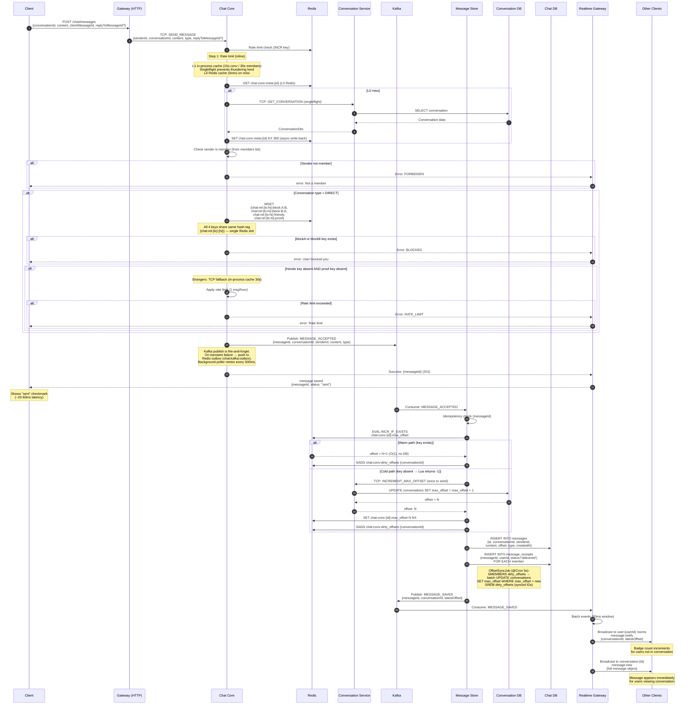

### Key Steps Explained

1. **Client Sends (HTTP POST)** — User sends message via `POST /chat/messages` with conversationId, content, and type. Gateway validates JWT and forwards to Chat Core via TCP.
2. **TCP Forward** — Realtime Gateway forwards to Chat Core with authenticated senderId.
3. **Rate Limit** — Inline Redis counter check (per senderId).
4. **Conversation + Members** — Fetched in parallel with singleflight coalescing:
   - **L1 in-process cache** (15s conv / 30s members): eliminates TCP calls under burst traffic.
   - **L0 Redis cache** (5min): fallback before TCP call.
   - **Singleflight**: N concurrent cache-misses → exactly 1 TCP call to conversation-service.
5. **Membership Check** — Sender must be a member (derived from already-fetched members list, 0 extra TCP calls).
6. **Friendship / Block Check (DIRECT only)** — Single Redis `MGET` fetches 4 co-located keys:
   - `{chat:rel:{lo}:{hi}}:block:{A}:{B}` — blocked by A
   - `{chat:rel:{lo}:{hi}}:block:{B}:{A}` — blocked by B
   - `{chat:rel:{lo}:{hi}}:friends` — LWW friend status (positive = friends, negative = tombstone)
   - `{chat:rel:{lo}:{hi}}:proof` — 30s race-condition bridge (set at accept-friend time)
   All 4 keys share the same hash tag → single Redis slot → safe on any cluster topology.
7. **Kafka Publish (fire-and-forget + outbox)** — Chat Core publishes MESSAGE_ACCEPTED then **returns 201 immediately**. On transient Kafka error → push event to Redis list `chat:kafka:outbox`; background poller (500ms) retries.
8. **Message Store Consumes** — MessageAcceptedConsumer picks up MESSAGE_ACCEPTED from Kafka.
9. **Atomic Offset via Redis INCR** — Lua `INCR_IF_EXISTS` script:
   - **Warm path**: Redis INCR → O(1), zero DB/TCP traffic. Adds conversationId to `dirty_offsets` set.
   - **Cold path** (Redis restart / eviction): Lua returns -1 → one TCP call to conversation-service to seed the counter with `NX`.
10. **Persist Message** — INSERT with the real offset (no more two-phase temp-offset pattern).
11. **OffsetSyncJob** — `@Cron('*/5 * * * * *')` in conversation-service: reads `dirty_offsets`, batch-fetches Redis counters, batch-updates `conversations.max_offset` in PostgreSQL.
12. **Publish Saved** — Message Store publishes MESSAGE_SAVED to Kafka.
13. **Batch Window** — Realtime Gateway batches events for 80ms to reduce broadcast storms.
14. **Tier 1 Broadcast** — Notify all members in their personal rooms (badge updates).
15. **Tier 2 Broadcast** — Send full message to users currently viewing the conversation.

### Error Scenarios

**Sender Not Member**
- Rejected at membership check with FORBIDDEN error.
- No Kafka event published. Client shows "You are not a member".

**Recipient Blocked Sender**
- Rejected at Redis MGET block check with BLOCKED error.
- No Kafka event published. Client shows "Unable to send message".

**Rate Limit Exceeded**
- Rejected with RATE_LIMIT_EXCEEDED error.
- Applied only to non-friends (friends key absent + proof key absent in Redis MGET).

**Kafka Unavailable (transient)**
- ChatCore pushes event to Redis outbox `chat:kafka:outbox`.
- Background poller (500ms) retries. Eventual delivery within seconds.
- Client already received 201; no error shown.

**Kafka Unavailable (persistent)**
- Outbox grows. Once Kafka recovers, poller drains the backlog in order.
- Messages are stored in correct offset order when Consumer processes them.

**Database Write Failure**
- Message Store fails to INSERT message. MESSAGE_SAVED never published.
- Recipients never receive message. Sender's client shows "sending…" indefinitely.
- Offset counter in Redis is already incremented → gap in offset sequence (recoverable by admin re-drive).

---

## Sticker Message Flow

### Description

End-to-end flow for sending a sticker. The key performance insight: a sticker message is **as fast as a text message** — the backend never touches any image file during the chat exchange. The sticker image URL was pre-loaded from `GET /stickers/packages` and the browser/app fetches it directly from storage.

### Phase 0: Pre-fetch (App Startup)

When the user opens the sticker keyboard, the client calls `GET /stickers/packages` (HTTP). The Gateway proxies to Message Store via TCP (`sticker.get_packages`), returning each package with a `thumbnailUrl` for its icon. The client then calls `GET /stickers/packages/:id/stickers` per package and caches all sticker URLs in memory.

### Flow Diagram

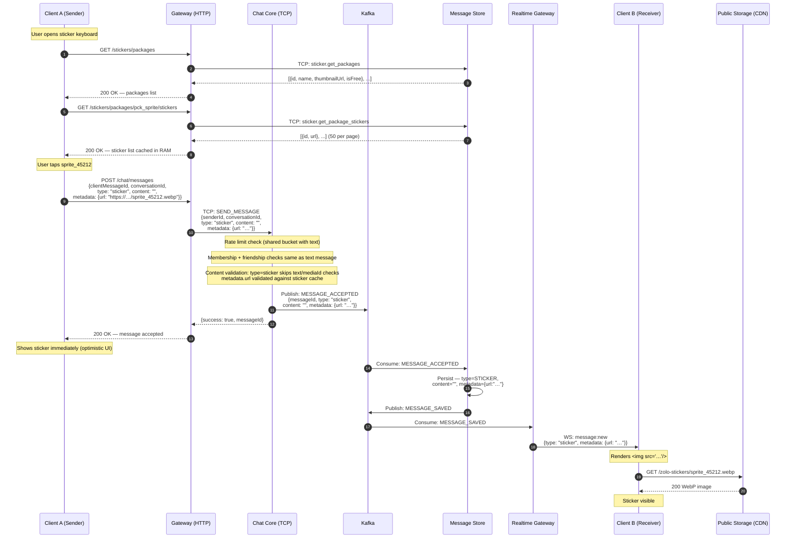

### Key Design Decisions

**Why no server-side URL validation when sending?**
Sticker URLs are static public assets on a CDN — no ownership or access-control concern. Validating the URL against the DB on every send would add a DB round-trip for zero security benefit. The client only has valid URLs because they came from `GET /stickers/packages/:id/stickers` in the first place.

**Why use the text ACL chain for stickers?**
Stickers have no `mediaId`; they reference pre-uploaded static files that the server never processes. The text chain checks membership, account status, and conversation permissions — exactly what is needed. The `MediaValidationRule` fires only when `context.media` is present, so it naturally skips for stickers.

**Why is `content` empty for stickers?**
`content` is the searchable/indexable text body of a message. Stickers carry no textual content; the sticker identity and display URL live in `metadata.url`. This keeps the message model consistent and avoids storing redundant data.

---

## Typing Indicator Flow

### Description
Real-time typing indicators for DIRECT and GROUP conversations. Not supported for ANNOUNCEMENT channels (members cannot post, so typing is irrelevant).

### Flow Diagram

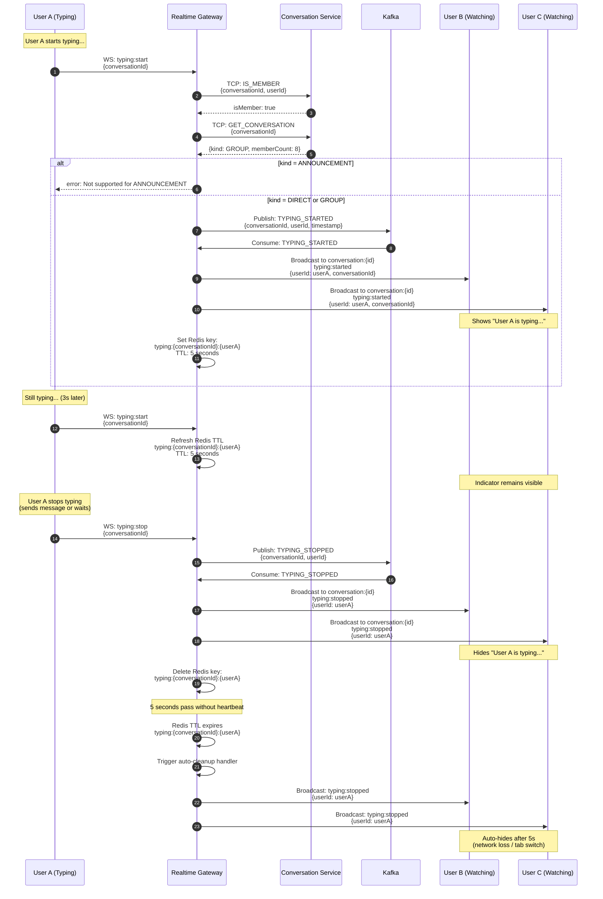

### Key Steps Explained

1. **Start Typing** - User A begins typing, client emits `typing:start`
2. **Validate Membership** - Ensure user is member of conversation
3. **Check Kind** - Verify conversation kind is DIRECT or GROUP (not ANNOUNCEMENT)
4. **Publish to Kafka** - TYPING_STARTED event published
5. **Consume Event** - Realtime Gateway consumes event
6. **Broadcast to Room** - Notify all members in conversation room (except sender)
7. **Set TTL** - Redis key with 5-second expiration for auto-cleanup
8. **Heartbeat** - Client re-emits `typing:start` every 3 seconds to keep indicator alive
9. **Refresh TTL** - Redis key TTL refreshed on each heartbeat
10. **Stop Typing** - User stops typing, client emits `typing:stop`
11. **Publish Stop Event** - TYPING_STOPPED event to Kafka
12. **Broadcast Stop** - Hide typing indicator for all members
13. **Delete Key** - Remove Redis key
14. **Auto-Cleanup** - If TTL expires without heartbeat, auto-broadcast stop event

### Design Decisions

**Why Kafka for Typing?**
- Decouples Realtime Gateway instances
- Multiple Realtime Gateway replicas can broadcast consistently
- Event log for debugging (short retention)

**Why Not Kafka for Typing?**
- Adds latency (~10-50ms)
- Could use Redis Pub/Sub for lower latency
- **Trade-off**: Consistency vs. latency

**Why 5-Second TTL?**
- Balance between responsiveness and unnecessary broadcasts
- Handles tab switches, network hiccups
- Prevents "stuck" typing indicators

**Why Not ANNOUNCEMENT?**
- ANNOUNCEMENT channels are read-only for members
- Members cannot send messages, so typing indicators are irrelevant

### Client Implementation

**Throttling**:
```javascript
let typingTimeout;

textarea.addEventListener('input', () => {
  socket.emit('typing:start', { conversationId });

  clearTimeout(typingTimeout);
  typingTimeout = setTimeout(() => {
    socket.emit('typing:stop', { conversationId });
  }, 2000); // Stop if no input for 2s
});
```

**Heartbeat** (every 3s):
```javascript
setInterval(() => {
  if (isTyping) {
    socket.emit('typing:start', { conversationId });
  }
}, 3000);
```

### Performance Considerations

**DIRECT or GROUP Conversation (10 members)**:
- 1 typing event -> 9 broadcasts (exclude sender)
- Kafka throughput: ~10,000 messages/sec
- Redis ops: ~100,000 ops/sec
- **Result**: No bottleneck

**Large GROUP (100 members)**:
- 1 typing event -> 99 broadcasts
- Still within capacity

**ANNOUNCEMENT Channel (many members)**:
- Typing not supported; members are read-only
- **Result**: Disabled for ANNOUNCEMENT kind

---

## Call Lifecycle Flow

### Description
Complete flow from when a user starts a meeting until all participants are notified and the meeting ends. Covers waiting room, media state changes, and recording.

### Flow Diagram

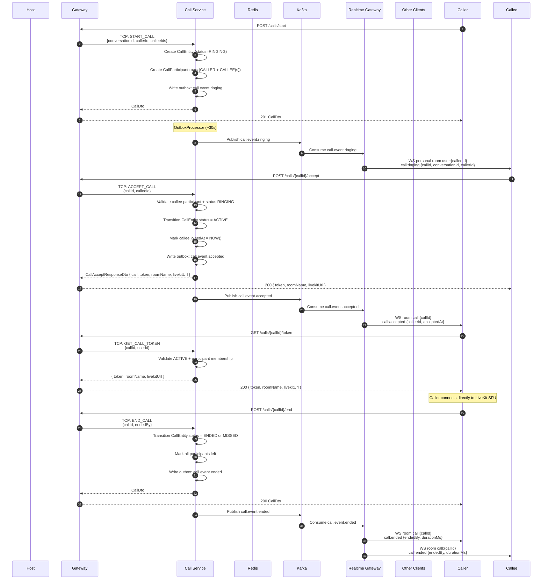

### Key Steps Explained

1. **Start Call** - Caller POSTs to Gateway; Call Service creates `CallEntity` + caller/callee participants
2. **Publish Ringing Event** - Outbox publishes `call.event.ringing`; Realtime Gateway broadcasts to each callee personal room
3. **Accept Call** - Callee accepts via Gateway → Call Service; call transitions to `ACTIVE` and callee gets a LiveKit token
4. **Notify Caller** - `call.event.accepted` is consumed by Realtime Gateway; caller joins the `call:{callId}` room
5. **Issue Caller Token** - Caller calls `GET /calls/{callId}/token` and connects directly to LiveKit SFU
6. **End Call** - Any participant ends the call; summary is written and `call.event.ended` is published
7. **Members Notified** - Realtime Gateway broadcasts end event; all clients close the call UI

---

## Authentication & WebSocket Connection Flow

### Description
How a client authenticates with Keycloak, obtains a JWT, and establishes an authenticated WebSocket connection to receive real-time events.

### Flow Diagram

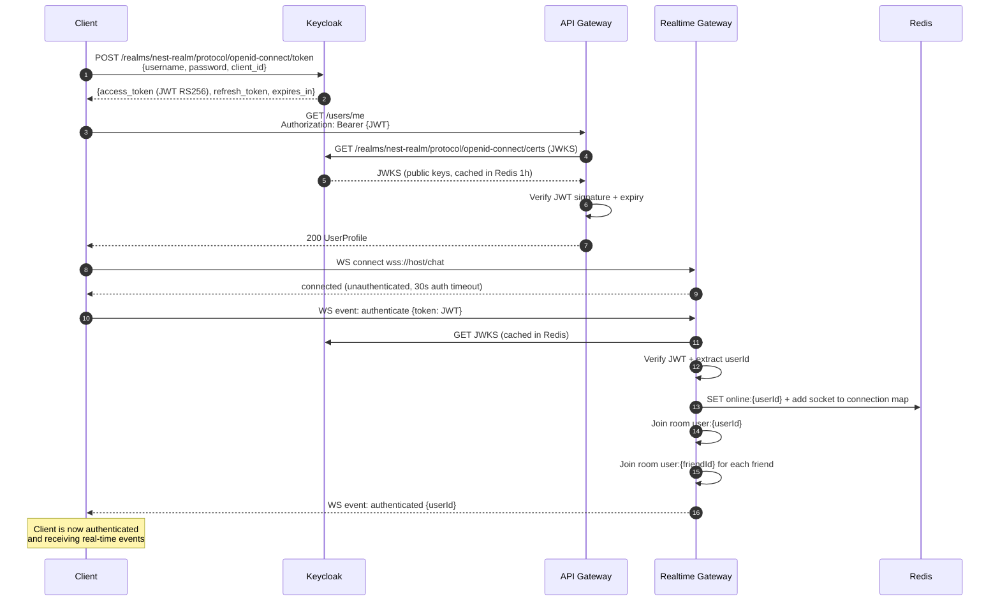

---

## Edit Message Flow

### Description
Flow when a user edits a previously sent message. Chat Core enforces the 1-hour edit window and saves an audit trail.

### Flow Diagram

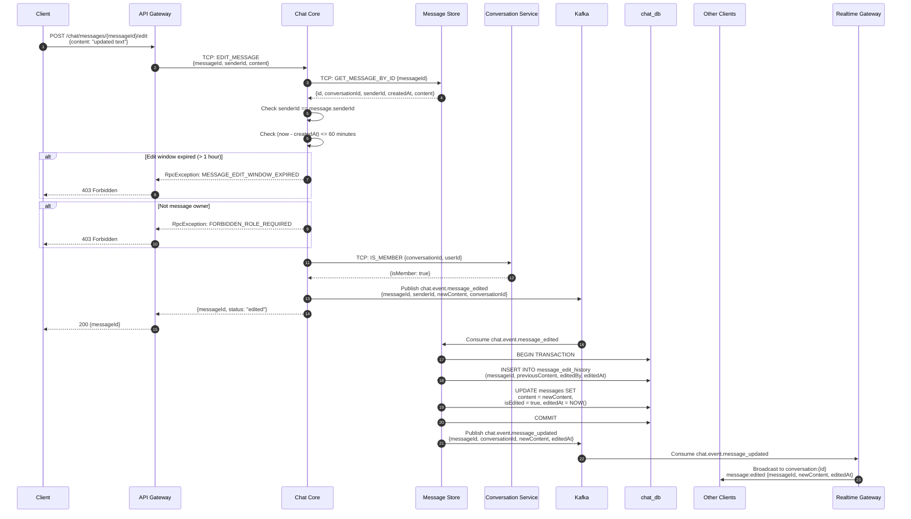

### Key Rules

- **Edit window**: 1 hour from `createdAt` (enforced by Chat Core using `MESSAGE_LIMITS.EDIT_WINDOW_MS`)
- **Ownership**: Only the original sender can edit (no ADMIN override for edit)
- **Audit trail**: Previous content always saved to `message_edit_history` before updating
- **`isEdited` flag**: Message row shows edit indicator in UI

---

## Delete Message Flow

### Description
Soft-delete flow. Own messages within 24 h, ADMIN can delete any within 24 h (plus audit log).

### Flow Diagram

```mermaid
sequenceDiagram
    autonumber
    participant Client
    participant Gateway as API Gateway
    participant ChatCore as Chat Core
    participant MsgStore as Message Store
    participant ConvSvc as Conversation Service
    participant Kafka
    participant ChatDB as chat_db
    participant Recipients as Other Clients
    participant RealtimeGW as Realtime Gateway

    Client->>Gateway: DELETE /chat/messages/{messageId}
    Gateway->>ChatCore: TCP: DELETE_MESSAGE {messageId, deletedBy}

    ChatCore->>MsgStore: TCP: GET_MESSAGE_BY_ID {messageId}
    MsgStore-->>ChatCore: {id, conversationId, senderId, createdAt}

    ChatCore->>ConvSvc: TCP: GET_MEMBERS_WITH_ROLES {conversationId}
    ConvSvc-->>ChatCore: [{userId, role}]

    ChatCore->>ChatCore: Resolve actor role from membership list

    alt Own message AND within 24 h (MSG.DELETE_OWN)
        ChatCore->>ChatCore: OK - proceed
    else ADMIN/OWNER AND within 24 h (MSG.DELETE_ANY)
        ChatCore->>ChatCore: OK - audit log required
    else Violation
        ChatCore-->>Gateway: RpcException: FORBIDDEN_TIME_WINDOW or FORBIDDEN_ROLE_REQUIRED
        Gateway-->>Client: 403 Forbidden
    end

    ChatCore->>Kafka: Publish chat.event.deleted<br/>{messageId, conversationId, deletedBy, isAdminDelete}
    ChatCore-->>Gateway: {messageId, deleted: true}
    Gateway-->>Client: 200

    Kafka->>MsgStore: Consume chat.event.deleted
    MsgStore->>ChatDB: UPDATE messages<br/>SET isDeleted = true, deletedAt = NOW()
    MsgStore->>Kafka: Publish chat.event.message_updated (isDeleted: true)

    Kafka->>RealtimeGW: Consume chat.event.message_updated
    RealtimeGW->>Recipients: Broadcast conversation:{id}<br/>message:deleted {messageId}

    Note over Recipients: "This message was deleted"<br/>shown in UI; content hidden
```

### Key Rules

- **Soft delete only**: `isDeleted = true`, `deletedAt = NOW()` — row is never removed
- **Own delete**: `MSG.DELETE_OWN` — sender only, within 24 h
- **Admin delete**: `MSG.DELETE_ANY` — OWNER/ADMIN only, within 24 h, all actions are logged
- **Content hidden**: Deleted messages return `{isDeleted: true, content: null}` from API

---

## Pin / Unpin Message Flow

### Description
Pin/unpin messages in a conversation. Max 3 pinned messages per conversation, OWNER/ADMIN only.

### Flow Diagram

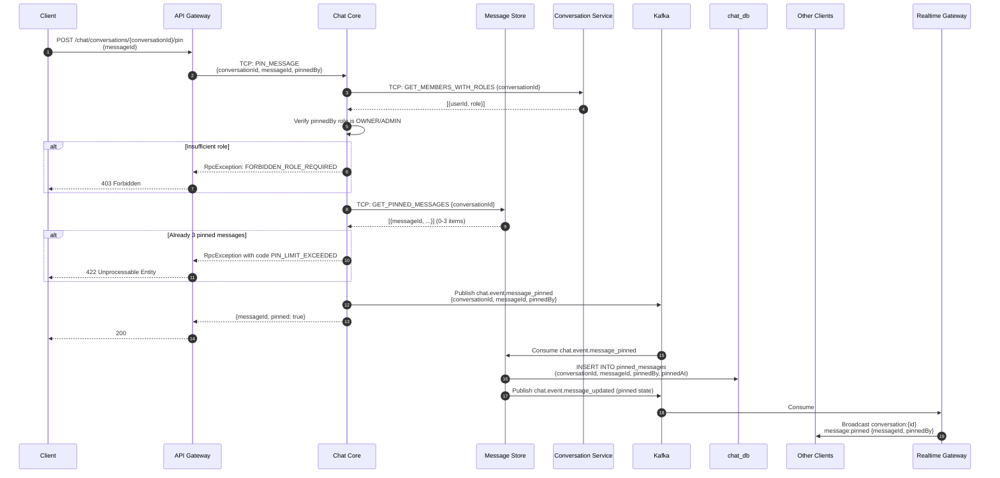

### Unpin Flow

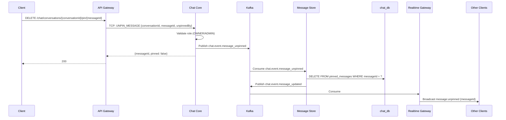

---

## Media Upload Flow (2-Phase Pre-signed URL)

### Description
Two-phase upload: pre-check before upload, then finalize after direct MinIO upload. Prevents uploading media that will be rejected.

### Flow Diagram

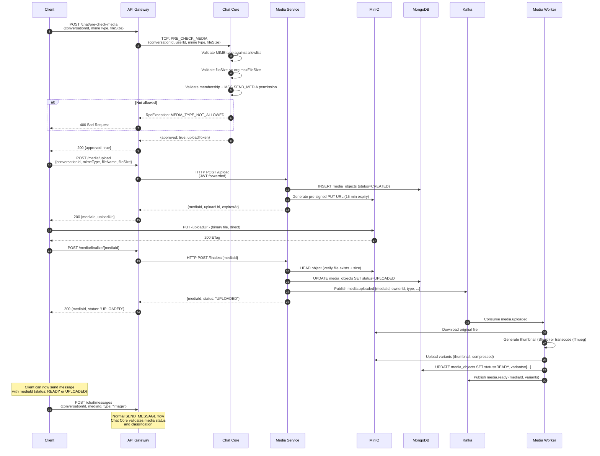

### Media States

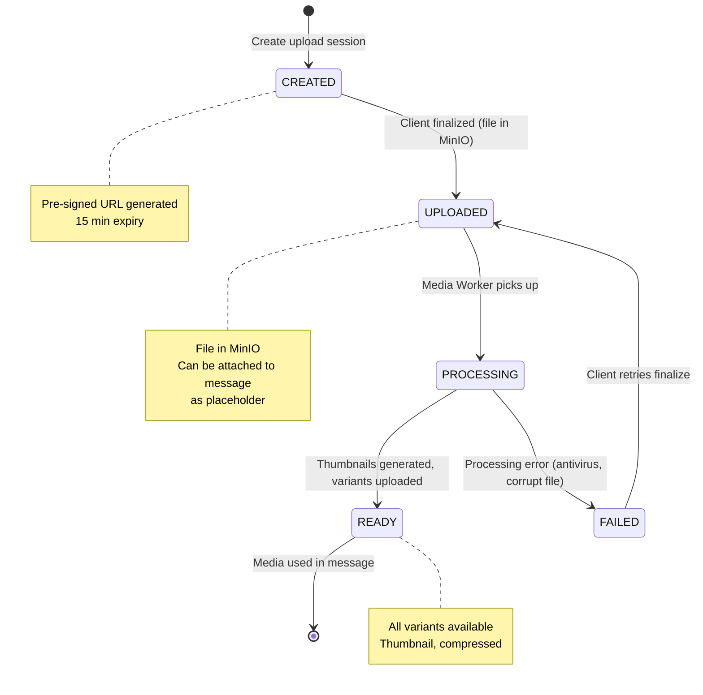

---

## Friend Request Flow (with Auto-create DIRECT Conversation)

### Description
Complete friendship lifecycle from friend request to auto-created DIRECT conversation, using transactional outbox and Kafka events.

### Flow Diagram

```mermaid
sequenceDiagram
    autonumber
    participant UserA
    participant Gateway as API Gateway
    participant FriendSvc as Friendship Service
    participant UsersSvc as Users Service
    participant UsersDB as users_db
    participant Kafka
    participant ConvSvc as Conversation Service
    participant ChatDB as chat_db
    participant RealtimeGW as Realtime Gateway
    participant UserB

    %% Phase 1: Send friend request
    UserA->>Gateway: POST /friends/request<br/>{toUserId: userB}
    Gateway->>FriendSvc: TCP: SEND_FRIEND_REQUEST<br/>{fromUserId: userA, toUserId: userB}

    FriendSvc->>UsersSvc: TCP: FIND_BY_ID {userId: userB}
    UsersSvc-->>FriendSvc: UserProfile (validate exists)

    FriendSvc->>UsersDB: BEGIN TRANSACTION
    FriendSvc->>UsersDB: INSERT INTO friend_requests<br/>(fromUserId, toUserId, status=PENDING)
    FriendSvc->>UsersDB: INSERT INTO outbox_events<br/>(type=FRIENDSHIP_REQUEST_SENT, payload)
    FriendSvc->>UsersDB: COMMIT

    FriendSvc-->>Gateway: {requestId, status: "PENDING"}
    Gateway-->>UserA: 201 {requestId}

    Note over FriendSvc: OutboxProcessor (~30s)
    FriendSvc->>Kafka: Publish friendship.request.sent<br/>{fromUserId, toUserId}
    Kafka->>RealtimeGW: Consume friendship.request.sent
    RealtimeGW->>UserB: WS broadcast to user:{userB}<br/>friend:request_received {fromUserId, fromUser}

    %% Phase 2: Accept friend request
    UserB->>Gateway: POST /friends/accept<br/>{fromUserId: userA}
    Gateway->>FriendSvc: TCP: ACCEPT_FRIEND_REQUEST<br/>{userId: userB, fromUserId: userA}

    FriendSvc->>UsersDB: BEGIN TRANSACTION
    FriendSvc->>UsersDB: UPDATE friend_requests SET status=ACCEPTED
    FriendSvc->>UsersDB: INSERT INTO friendships (userA, userB, FRIEND)
    FriendSvc->>UsersDB: INSERT INTO friendships (userB, userA, FRIEND)
    FriendSvc->>UsersDB: INSERT INTO outbox_events (type=FRIENDSHIP_ACCEPTED)
    FriendSvc->>UsersDB: COMMIT

    %% Gateway immediately writes FRIENDSHIP_PROOF key (race-condition bridge)
    Gateway->>Redis: SET {chat:rel:{lo}:{hi}}:proof 1 EX 30
    Note over Redis: FRIENDSHIP_PROOF key: 30s TTL<br/>Covers Kafka consumer lag so ChatCore<br/>doesn't incorrectly rate-limit "just-friends" messages

    FriendSvc-->>Gateway: {status: "FRIEND"}
    Gateway-->>UserB: 200

    Note over FriendSvc: OutboxProcessor (~30s)
    FriendSvc->>Kafka: Publish friendship.request.accepted<br/>{userId: userB, friendId: userA, brokerTimestamp}

    %% FriendshipFriendsConsumer caches friend status in Redis
    Kafka->>ChatCore: Consume friendship.request.accepted<br/>(consumer group: nest-chat.chat-core.friend-cache)
    ChatCore->>Redis: Lua CAS SET {chat:rel:{lo}:{hi}}:friends = +brokerTs EX 2592000
    Note over Redis: LWW Register: positive Unix-ms = friends<br/>Immune to Kafka out-of-order delivery<br/>TTL: 30 days (safety-net; primary eviction is event-driven)

    %% Phase 3: Auto-create DIRECT conversation
    Kafka->>ConvSvc: Consume friendship.request.accepted
    ConvSvc->>ChatDB: BEGIN TRANSACTION
    ConvSvc->>ChatDB: INSERT INTO conversations<br/>(type=DIRECT, memberCount=2)
    ConvSvc->>ChatDB: INSERT INTO conversation_members<br/>(conversationId, userA, role=MEMBER)
    ConvSvc->>ChatDB: INSERT INTO conversation_members<br/>(conversationId, userB, role=MEMBER)
    ConvSvc->>ChatDB: INSERT INTO outbox_events<br/>(type=CONVERSATION_CREATED)
    ConvSvc->>ChatDB: COMMIT

    Note over ConvSvc: OutboxProcessor (~30s)
    ConvSvc->>Kafka: Publish chat.event.conversation_created<br/>{conversationId, type: DIRECT, memberIds}

    Kafka->>RealtimeGW: Consume conversation_created
    RealtimeGW->>UserA: WS broadcast to user:{userA}<br/>conversation:new {conversationId, type: DIRECT}
    RealtimeGW->>UserB: WS broadcast to user:{userB}<br/>conversation:new {conversationId, type: DIRECT}

    Note over UserA,UserB: Both users now see<br/>the DIRECT conversation<br/>in their chat list
```

---

## Member Add / Remove Flow

### Description
Adding or removing a member from a GROUP or ANNOUNCEMENT conversation, with cache invalidation and real-time notifications.

### Flow Diagram

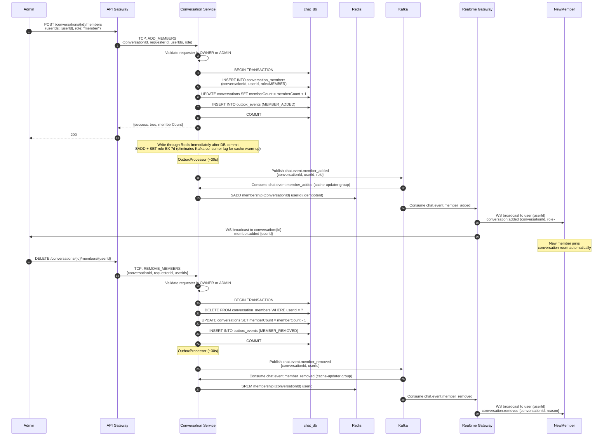

---

## Read Receipt / Mark as Read Flow

### Description
How the client marks a conversation as read, updating the cursor-based read tracking without a separate receipts table.

### Flow Diagram

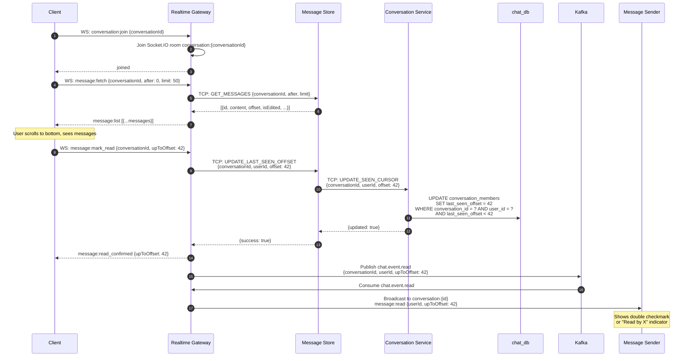

---

## Flow 10 — Thu hồi tin nhắn (Revoke Message)

**Điều kiện**: chỉ người gửi, trong vòng **1 giờ** kể từ khi gửi.  
**Kết quả**: tất cả thành viên conversation thấy placeholder "Tin nhắn đã bị thu hồi".

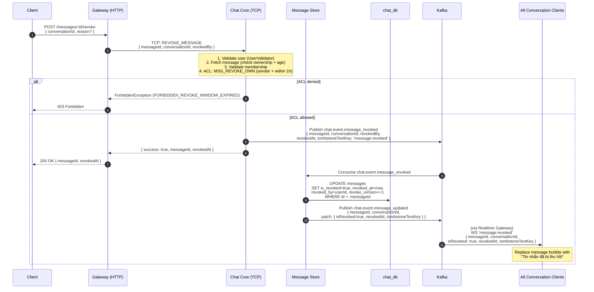

---

## Flow 11 — Xóa tin nhắn phía tôi (Delete For Me)

**Điều kiện**: bất kỳ thành viên, không giới hạn thời gian.  
**Kết quả**: tin nhắn ẩn khỏi lịch sử chat của người yêu cầu; người khác không bị ảnh hưởng.

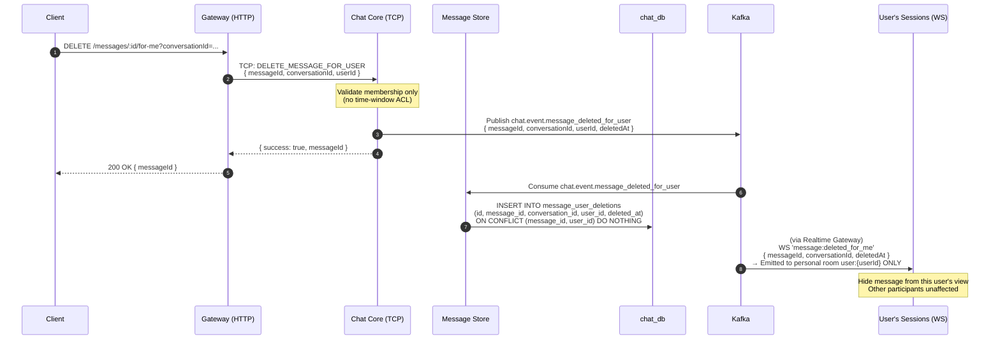

---

## Flow 12 — Chuyển tiếp tin nhắn (Forward Message)

**Điều kiện**: phải là thành viên của cả conversation nguồn và tất cả conversation đích.  
**Kết quả**: tin nhắn mới được tạo trong từng conversation đích, kèm `forwardedFrom` metadata.

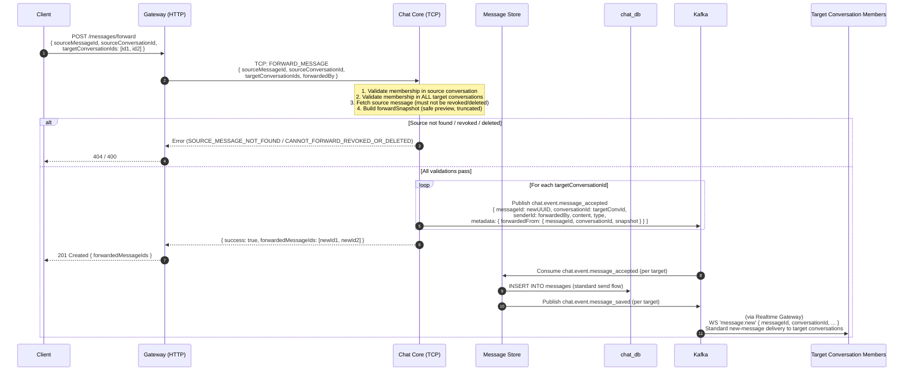

---

## References

- [DATA_FLOW_PATTERNS.md](../integration/DATA_FLOW_PATTERNS.md) - Additional end-to-end flows
- [SERVICE_COMMUNICATION.md](../integration/SERVICE_COMMUNICATION.md) - Service-to-service communication patterns
- [system-architecture.md](./system-architecture.md) - Overall system architecture
- [kafka-topology.md](./kafka-topology.md) - Kafka topic and partition details
- [call-service.md](../services/call-service.md) - Call Service detailed documentation
- [database-relations.md](./database-relations.md) - Database schemas and entity relationships
